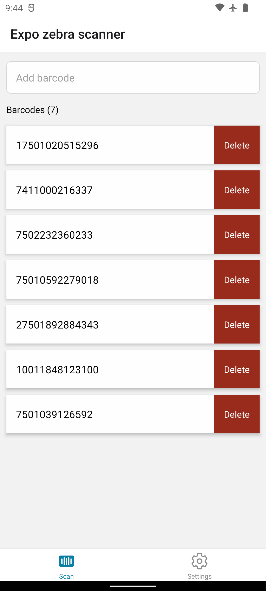

# Example app

This app shows how expo-zebra-scanner can be used to create and customize datawedge profiles, read barcodes with intent output, change settings on the fly and switch between outputs.

## Run the example

```bash
cd example
npm install
npm run android
```

## Screenshots

<p align="center">
  
  
</p>
